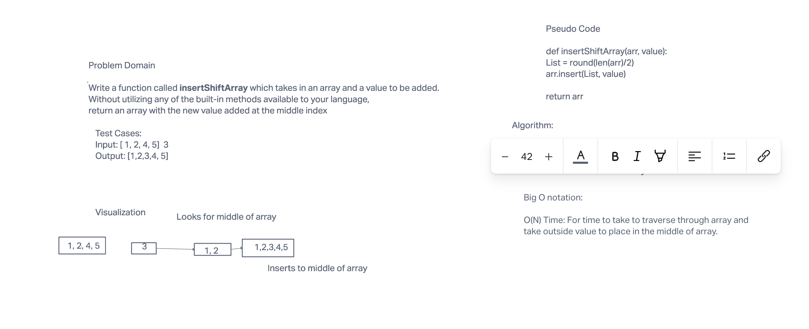

# Array-insert-Shift

## Insert to Middle of an Array

The assignment is to write a function that takes in a array and value to be added to middle list

## Whiteboard Process

## Approach & Efficiency

Big-O for time to traverse through list and place outside value in middle of array.
