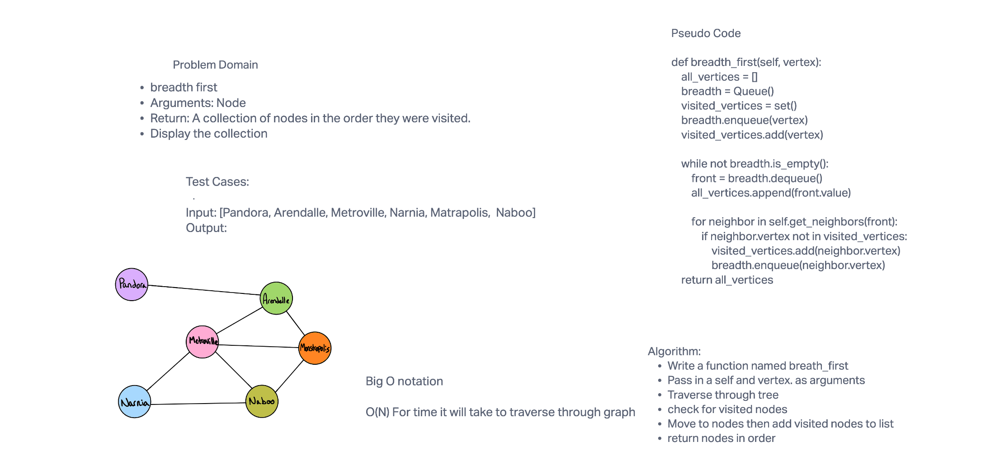

# Challenge Summary

- Create a breadth-first traversal on a graph then
- return the items in the order they were traversed

## Assignment:

breadth first
Arguments: Node
Return: A collection of nodes in the order they were visited.
Display the collection

## Whiteboard Process

## Approach & Efficiency

- Big O Notation O(N)

## Solution

- pytest
