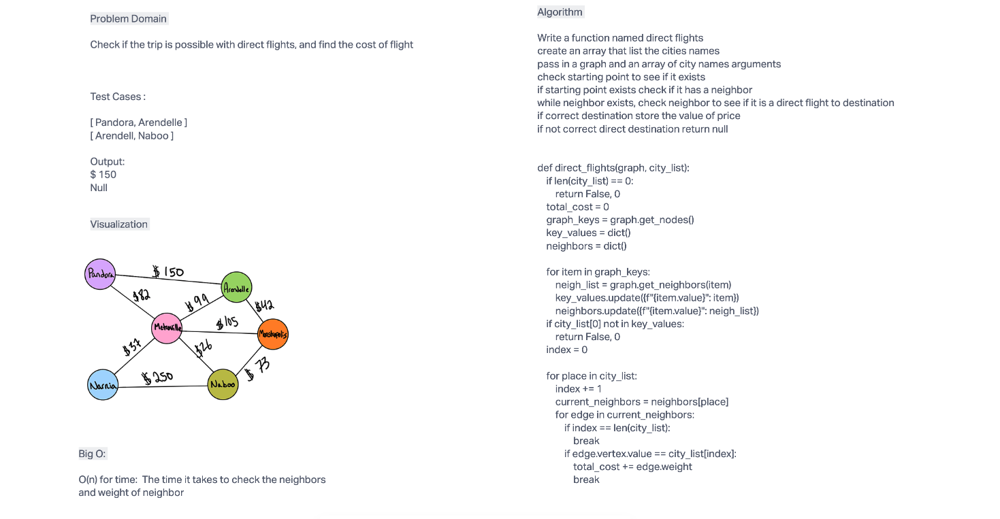

# Code Challenge - 37

## Challenge Summary

Using a graph, write a function that determines if a trip is possible using direct flights
and determine how much it would cost.

## Whiteboard Process

## Approach & Efficiency

Big O notation: O(N) for time

## Solution

run code using `python graph_buisness_trip.py`
run test using `pytest`

