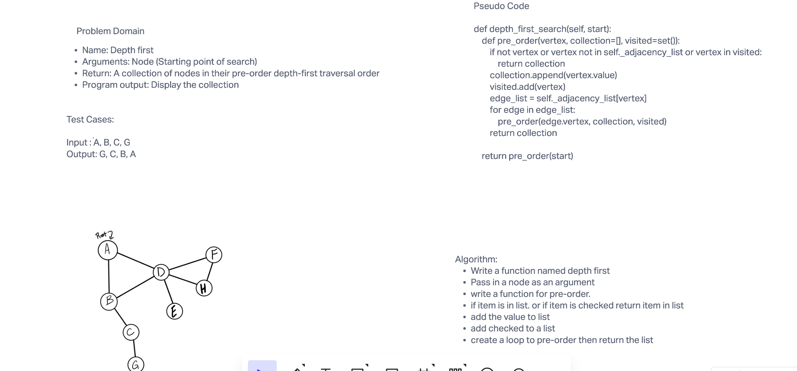

# Depth First Traversal

## Challenge

Write a Depth first function. Develop a preorder traversal on a graph then return collection in a pre-order
depth first traversal order

## Approach & Efficiency

Big O Notation
O(N) for time that it will take to traverse the graph

## Solution

