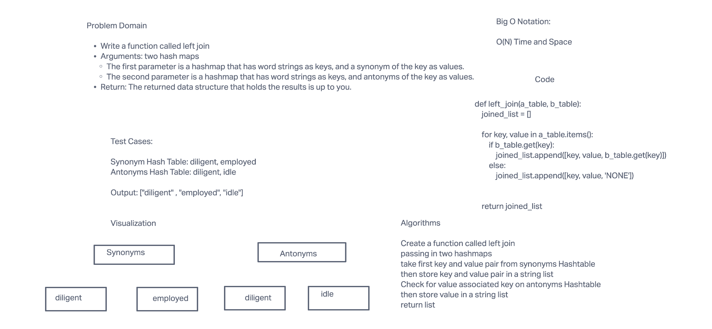

# Hashmap LEFT JOIN - Lab 33

## Challenge

The challenge is to write a function called left join that takes in two hashmaps and
checks the key value pairs and matches them together

## Approach & Efficiency

Big O notation
O(N) for space and time

## Solution

