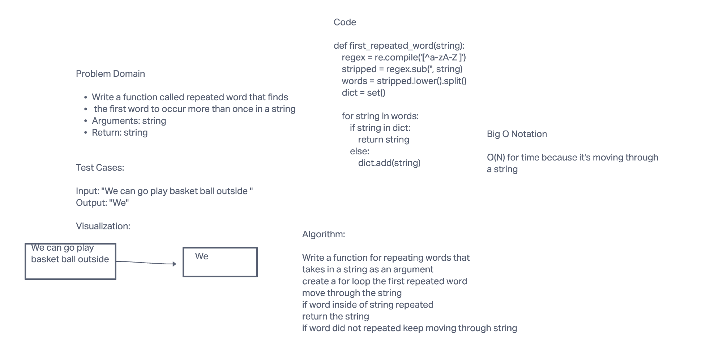

# Challenge Summary

The challenge is to write a function called repeated word
that finds the first word to occur more than once in a string that
takes in a string and returns a string.

## Whiteboard Process

## Approach & Efficiency

Big O Notation
O(N) For time because you're traversing through a string

