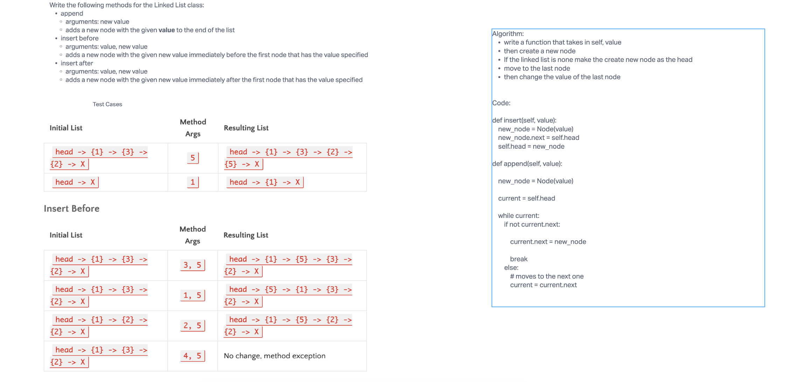

# Linked List Insertions - Code Challenge 6

## Challenge Summary

- The challenge is to add three methods to the previous created Linked List code.
- New methods will append a new node to end of list
- insert new node before a before index
- insert new node after a index in the list

## Whiteboard Process

## Approach & Efficiency

O(N) for time
