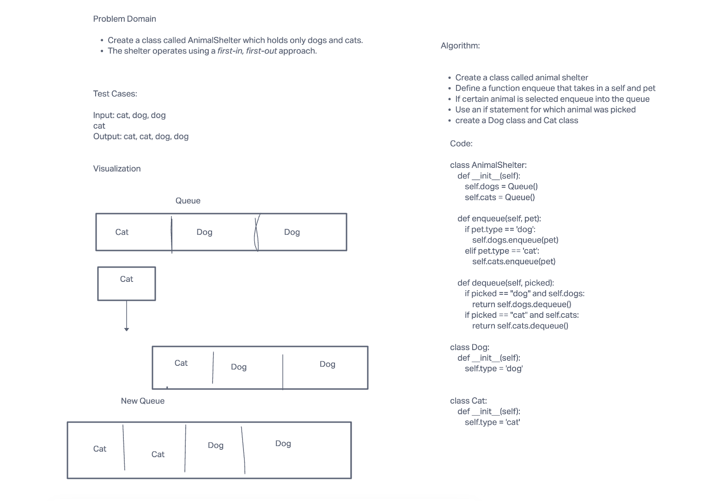

# Challenge Summary - Code Challenge 12

- The challenge is to create a class called AnimalShelter that can hold dogs and cats using a
- first in first out approach queue

## Whiteboard Process

## Approach & Efficiency

- Big O Notation:
- O(N) for time
