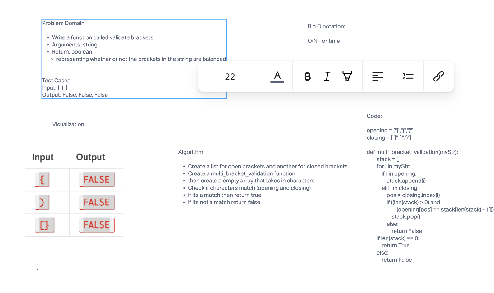

# Challenge Summary - Code Challenge 13

The challenge is to write a function that validates matching brackets
or if brackets do not match

## Whiteboard Process

## Approach & Efficiency

Big O Notation: O(N) Time
