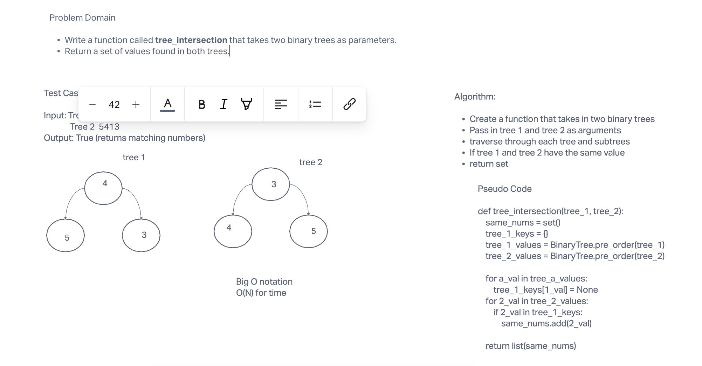

# Challenge Summary

To write a function called tree_intersection that takes two binary trees as parameters.
Return a set of values found in both trees.

## Whiteboard Process

## Approach & Efficiency

Using key, value, the method will hash the key, and set the key and value pair in the table.
Big O notation: O(N) for time

## Solution

`pytest`
`python tree_intersection`
